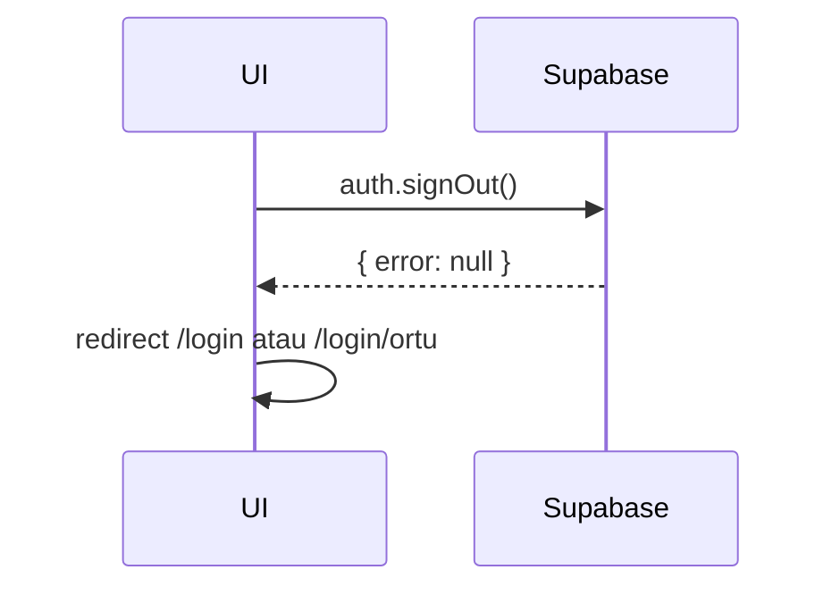

# UC-003 — Logout

Document Version: v1.0
Use Case ID: UC-003
Use Case Name: Logout
File Path: ./sys_uc_003.md
Status: Draft
Actors: Semua Role
Complexity: 🟢 Simple
Tabel Utama: —

## Purpose

User melakukan logout dari aplikasi. Supabase Auth menghapus session dan user diredirect ke halaman login sesuai rolenya.

## Preconditions

- User sudah login dan memiliki session aktif.

## Main Flow

1. User menekan ikon profil di topbar → membuka halaman profil.
2. User menekan tombol "Keluar".
3. UI menampilkan dialog konfirmasi.
4. User menekan "Ya, Keluar".
5. UI memanggil `supabase.auth.signOut()`.
6. Supabase menghapus session.
7. UI redirect sesuai role terakhir:
   - Orang Tua → `/login/ortu`
   - Role lain → `/login`

## Alternate / Error Flows

- User menekan "Batal" → dialog tertutup, tidak ada perubahan.
- Session sudah expired → `supabase.auth.onAuthStateChange` otomatis redirect ke login.

## Sequence Diagram



## API Contract (Supabase SDK)

```javascript
const { error } = await supabase.auth.signOut();
// Redirect setelah signOut
router.push(userRole === 'orang_tua' ? '/login/ortu' : '/login');
```

## Data Model

Tidak ada perubahan data.

## Validation Rules

Tidak ada.

## Security & Permissions

- Session dihapus di sisi Supabase Auth otomatis.
- Tidak ada RLS yang terlibat.

## Traceability

User Flow: userflow_uc_003.md
SRS: F-01

---
