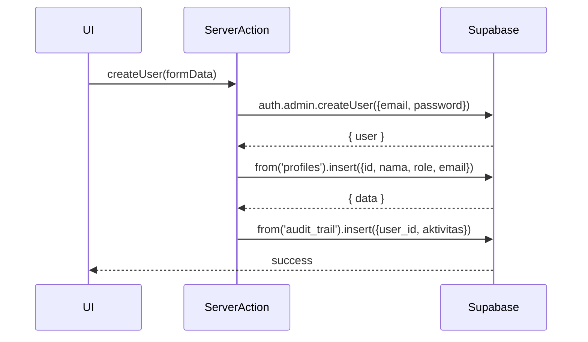

# UC-004 — CRUD Akun Pengguna

Document Version: v1.0
Use Case ID: UC-004
Use Case Name: CRUD Akun Pengguna
File Path: ./sys_uc_004.md
Status: Draft
Actors: Staff TU
Complexity: 🟡 Medium
Tabel Utama: profiles, orang_tua, audit_trail

## Purpose

Staff TU mengelola seluruh akun pengguna: membuat, melihat, mengedit, reset password, dan menghapus akun untuk semua role termasuk Orang Tua. Operasi `auth.admin.*` hanya bisa dipanggil dari server-side menggunakan service role key.

## Preconditions

- Staff TU sudah login.
- Berada di halaman `/tu/akun`.

## Main Flow

**Create:**
1. TU menekan "Tambah Akun", mengisi form (nama, role, email/HP, password awal).
2. Server Action memanggil `supabase.auth.admin.createUser()`.
3. Insert data profil ke `profiles` atau `orang_tua` sesuai role.
4. Catat ke `audit_trail`.

**Read:**
1. UI mengambil semua data dari `profiles` dan `orang_tua`.
2. Ditampilkan dalam tabel dengan filter role dan pencarian nama.

**Update:**
1. TU menekan "Edit", mengubah data, menekan "Simpan".
2. UI update baris di `profiles` atau `orang_tua`.

**Reset Password:**
1. TU menekan "Reset Password", mengisi password baru.
2. Server Action memanggil `supabase.auth.admin.updateUserById()`.

**Delete:**
1. TU menekan "Hapus" → konfirmasi.
2. Server Action memanggil `supabase.auth.admin.deleteUser()`.
3. Cascade delete otomatis hapus baris di `profiles`/`orang_tua`.
4. Catat ke `audit_trail`.

## Alternate / Error Flows

- Email/nomor HP sudah terdaftar → tampilkan "Email/nomor HP sudah digunakan".
- Field wajib kosong → tampilkan error per field.

## Sequence Diagram



## API Contract (Supabase SDK)

```javascript
// Server Action — gunakan service role key
const supabaseAdmin = createClient(url, SERVICE_ROLE_KEY);

// Create akun internal
const { data: authData } = await supabaseAdmin.auth.admin.createUser({
  email: 'user@example.com',
  password: 'password123',
  email_confirm: true
});
await supabaseAdmin.from('profiles').insert({
  id: authData.user.id,
  nama_lengkap: 'Nama User',
  role: 'pengampu',
  email: 'user@example.com'
});

// Create akun orang tua
const phoneAsEmail = `${nomorHP}@ortu.sitahfiz`;
const { data: authOrtu } = await supabaseAdmin.auth.admin.createUser({
  email: phoneAsEmail,
  password: 'password123',
  email_confirm: true
});
await supabaseAdmin.from('orang_tua').insert({
  id: authOrtu.user.id,
  nama_lengkap: 'Nama Ortu',
  nomor_hp: nomorHP
});

// Reset password
await supabaseAdmin.auth.admin.updateUserById(userId, {
  password: 'newpassword123'
});

// Delete
await supabaseAdmin.auth.admin.deleteUser(userId);
await supabaseAdmin.from('audit_trail').insert({
  user_id: currentUser.id,
  aktivitas: `Hapus akun: ${namaUser}`
});
```

## Data Model

- `profiles` — id, nama_lengkap, role, email, created_at
- `orang_tua` — id, nama_lengkap, nomor_hp, created_at
- `audit_trail` — id, user_id, aktivitas, created_at

## Validation Rules

- nama_lengkap: required
- role: required, enum (tu, koordinator, pengampu, kepsek, orang_tua)
- email: required jika bukan orang_tua, format email valid, unique
- nomor_hp: required jika orang_tua, numerik, minimal 10 digit, unique
- password: required saat create, minimal 8 karakter

## Security & Permissions

- Hanya role `tu` yang boleh akses halaman ini.
- Operasi `auth.admin.*` wajib dipanggil dari Next.js Server Action menggunakan `SERVICE_ROLE_KEY` — tidak boleh dari client.
- RLS `profiles`: hanya `tu` yang boleh INSERT, UPDATE, DELETE semua row.
- RLS `orang_tua`: hanya `tu` yang boleh INSERT, UPDATE, DELETE semua row.

## Traceability

User Flow: userflow_uc_004.md
SRS: F-17

---
