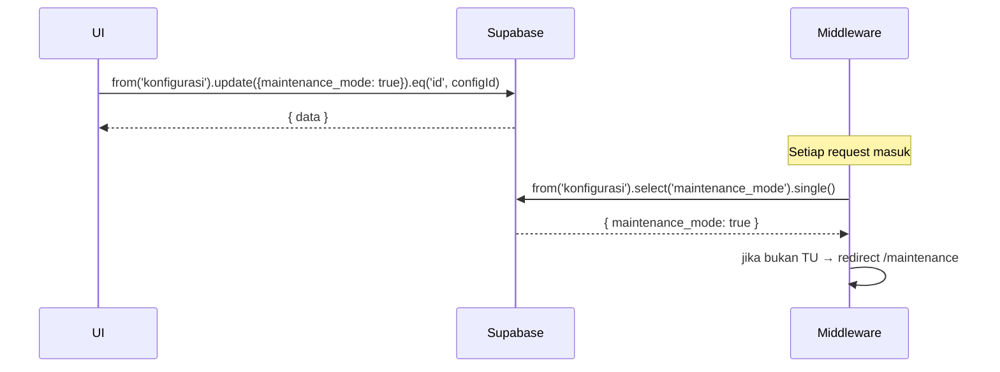

---

# UC-012 — Aktifkan/Nonaktifkan Maintenance Mode

Document Version: v1.0
Use Case ID: UC-012
Use Case Name: Aktifkan/Nonaktifkan Maintenance Mode
File Path: ./sys_uc_012.md
Status: Draft
Actors: Staff TU
Complexity: 🟡 Medium
Tabel Utama: konfigurasi

## Purpose

Staff TU mengaktifkan atau menonaktifkan maintenance mode. Saat aktif, semua role selain TU di-redirect ke halaman `/maintenance` oleh Next.js middleware dan tidak dapat mengakses fitur apapun.

## Preconditions

- Staff TU sudah login.
- Berada di halaman `/tu/konfigurasi`.

## Main Flow

**Aktifkan:**
1. TU menekan toggle "Maintenance Mode" → konfirmasi muncul.
2. TU menekan "Ya, Aktifkan".
3. UI update `konfigurasi.maintenance_mode = true`.
4. Next.js middleware mulai redirect semua non-TU ke `/maintenance` pada request berikutnya.

**Nonaktifkan:**
1. TU menekan toggle yang sedang aktif → konfirmasi muncul.
2. TU menekan "Ya, Nonaktifkan".
3. UI update `konfigurasi.maintenance_mode = false`.
4. Semua pengguna dapat kembali mengakses sistem.

## Alternate / Error Flows

- TU menekan "Batal" → toggle kembali ke posisi semula, tidak ada perubahan.
- Koneksi gagal saat update → toggle kembali ke posisi semula, tampilkan error.

## Sequence Diagram



## API Contract (Supabase SDK)

```javascript
// Toggle maintenance mode (dari UI)
await supabase.from('konfigurasi')
  .update({
    maintenance_mode: true,
    updated_at: new Date().toISOString()
  })
  .eq('id', configId);

// Di middleware.ts — gunakan service role key
// agar tidak terkena RLS dan tidak infinite loop
const supabaseMiddleware = createClient(url, SERVICE_ROLE_KEY);
const { data: config } = await supabaseMiddleware
  .from('konfigurasi')
  .select('maintenance_mode')
  .single();

if (config.maintenance_mode && userRole !== 'tu') {
  return NextResponse.redirect(new URL('/maintenance', request.url));
}
```

## Data Model

- `konfigurasi` — maintenance_mode, updated_at

## Validation Rules

- maintenance_mode: boolean

## Security & Permissions

- Hanya role `tu` yang boleh UPDATE `konfigurasi`.
- Middleware membaca `konfigurasi` menggunakan service role key untuk bypass RLS dan menghindari infinite redirect loop.

## Traceability

User Flow: userflow_uc_012.md
SRS: F-17

---
