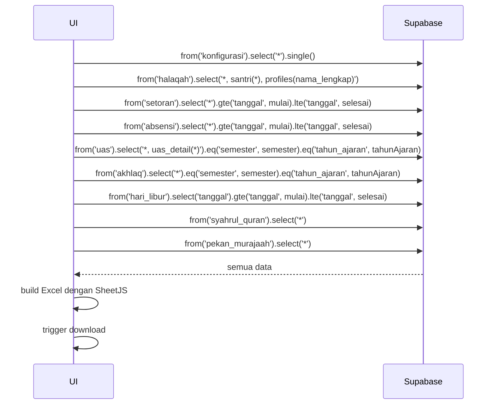

# UC-030 — Download Rekap Excel (Koordinator)

Document Version: v1.0
Use Case ID: UC-030
Use Case Name: Download Rekap Excel
File Path: ./sys_uc_030.md
Status: Draft
Actors: Koordinator
Complexity: 🔴 Complex
Tabel Utama: setoran, absensi, uas, uas_detail, akhlaq, hari_libur, syahrul_quran, pekan_murajaah, konfigurasi

## Purpose

Koordinator men-generate dan mengunduh file Excel rekap semester seluruh santri, dikelompokkan per halaqah. File berisi setoran per pekan per bulan, nilai akhir, rank per halaqah, dengan penandaan khusus untuk pekan Syahrul Quran (★) dan Pekan Murajaah.

## Preconditions

- Koordinator sudah login.
- Berada di halaman `/koordinator/rekap`.
- Konfigurasi tanggal semester sudah diisi TU.

## Main Flow

1. Koordinator memilih semester (ganjil/genap) dan tahun ajaran → menekan "Generate Rekap".
2. UI mengambil seluruh data yang dibutuhkan dari Supabase secara paralel.
3. UI membangun struktur Excel per halaqah menggunakan SheetJS.
4. Untuk setiap pekan, UI cek apakah masuk periode Syahrul Quran (tandai ★) atau Pekan Murajaah (tandai khusus).
5. UI hitung nilai akhir per santri menggunakan formula dari `konfigurasi`.
6. UI hitung rank per halaqah berdasarkan nilai akhir.
7. Browser mengunduh file Excel.

## Formula Kalkulasi Nilai Akhir

```
Nilai Setoran Harian = (total_baris_aktual / total_baris_target) × 100, maks 100
Nilai Kehadiran = ((hari_efektif - jumlah_alpha) / hari_efektif) × 100
Nilai Akhir = (setoran × bobot_setoran%) + (uas × bobot_uas%) + (akhlaq × bobot_akhlaq%) + (kehadiran × bobot_kehadiran%)
```

Dalam Setoran:
```
Nilai Setoran = (Sabak × 30%) + (Sabki × 30%) + (Manzil × 40%)
```

## Hari Efektif

- Senin–Jumat saja
- Dikurangi tanggal yang ada di tabel `hari_libur`
- Dikurangi periode Syahrul Quran (karena Sabki dan Manzil tidak dihitung)

## Struktur Kolom Excel Per Sheet (Per Halaqah)

```
[No + Nama Lengkap + Kelas]
[Bulan 1: Pekan 1 Sabak | Sabki | Manzil | Pekan 2 ... | Tidak Tercapai | Total Bulan]
[Bulan 2: ...]
[Total Semester Sabak | Sabki | Manzil]
[Total Hari Efektif]
[Nilai Setoran Harian 40%]
[Nilai UAS 40%]
[Nilai Akhlaq 10%]
[Nilai Kehadiran 10%]
[Nilai Raport]
[Rank]
```

## Alternate / Error Flows

- Filter belum dipilih → tampilkan "Pilih semester dan tahun ajaran".
- Tidak ada data → tampilkan "Tidak ada data untuk semester ini".
- Generate gagal → tampilkan error state dengan tombol "Coba Lagi".

## Sequence Diagram



## API Contract (Supabase SDK)

```javascript
// Ambil semua data secara paralel
const [config, halaqahList, setoranList, absensiList, uasList, akhlaqList, hariLiburList, syahrulList, pekanList] =
  await Promise.all([
    supabase.from('konfigurasi').select('*').single(),
    supabase.from('halaqah').select('*, profiles(nama_lengkap), santri(id, nama_lengkap, kelas, grade)'),
    supabase.from('setoran').select('*').gte('tanggal', tanggalMulai).lte('tanggal', tanggalSelesai),
    supabase.from('absensi').select('*').gte('tanggal', tanggalMulai).lte('tanggal', tanggalSelesai),
    supabase.from('uas').select('*, uas_detail(*)').eq('semester', semester).eq('tahun_ajaran', tahunAjaran),
    supabase.from('akhlaq').select('*').eq('semester', semester).eq('tahun_ajaran', tahunAjaran),
    supabase.from('hari_libur').select('tanggal').gte('tanggal', tanggalMulai).lte('tanggal', tanggalSelesai),
    supabase.from('syahrul_quran').select('*'),
    supabase.from('pekan_murajaah').select('*')
  ]);

// Generate Excel dengan SheetJS
import * as XLSX from 'xlsx';
const wb = XLSX.utils.book_new();

for (const halaqah of halaqahList.data) {
  const wsData = buildSheetData(halaqah, setoranList.data, absensiList.data, ...);
  const ws = XLSX.utils.aoa_to_sheet(wsData);
  XLSX.utils.book_append_sheet(wb, ws, halaqah.nama_halaqah);
}

XLSX.writeFile(wb, `Rekap_${semester}_${tahunAjaran}.xlsx`);
```

## Data Model

Melibatkan: konfigurasi, halaqah, santri, profiles, setoran, absensi, uas, uas_detail, akhlaq, hari_libur, syahrul_quran, pekan_murajaah, target_murajaah

## Validation Rules

- semester: required, enum (ganjil, genap)
- tahun_ajaran: required, format "YYYY/YYYY"

## Security & Permissions

- RLS: koordinator boleh SELECT semua tabel yang dibutuhkan.
- Pengampu dan Kepsek juga boleh akses endpoint ini (lihat UC-033).

## Traceability

User Flow: userflow_uc_030.md
SRS: F-11, F-12

---
