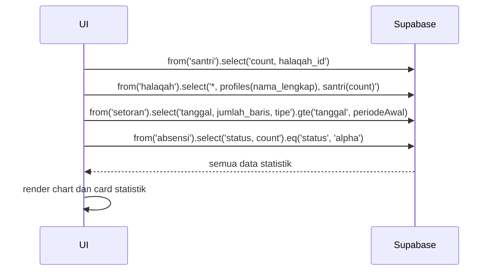

# UC-032 — Lihat Dashboard Statistik

Document Version: v1.0
Use Case ID: UC-032
Use Case Name: Lihat Dashboard Statistik
File Path: ./sys_uc_032.md
Status: Draft
Actors: Kepala Sekolah
Complexity: 🟡 Medium
Tabel Utama: santri, halaqah, setoran, absensi

## Purpose

Kepala Sekolah melihat dashboard statistik program tahfiz secara keseluruhan. Hanya read-only, tidak ada aksi input.

## Preconditions

- Kepsek sudah login.
- Berada di halaman `/kepsek/dashboard`.
- Sudah ada data santri dan setoran di sistem.

## Main Flow

1. UI mengambil data statistik secara paralel dari Supabase.
2. UI menampilkan dashboard berisi:
   - Total santri aktif per halaqah.
   - Total halaqah dan pengampu.
   - Grafik perkembangan total baris setoran per bulan (Recharts).
   - Rata-rata nilai setoran per halaqah.
   - Statistik kehadiran (persentase alpha keseluruhan).
3. Kepsek dapat filter berdasarkan semester atau bulan tertentu.

## Alternate / Error Flows

- Data belum ada → tampilkan empty state per komponen statistik.
- Gagal fetch → tampilkan error state dengan tombol "Coba Lagi".

## Sequence Diagram



## API Contract (Supabase SDK)

```javascript
// Paralel fetch semua statistik
const [santriCount, halaqahList, setoranData, alphaCount] = await Promise.all([
  supabase.from('santri').select('*', { count: 'exact', head: true }),

  supabase.from('halaqah').select(`
    id, nama_halaqah, grade,
    profiles(nama_lengkap),
    santri(count)
  `),

  supabase.from('setoran')
    .select('tanggal, jumlah_baris, tipe')
    .gte('tanggal', periodeAwal)
    .lte('tanggal', periodeAkhir),

  supabase.from('absensi')
    .select('*', { count: 'exact', head: true })
    .eq('status', 'alpha')
    .gte('tanggal', periodeAwal)
]);

// Data untuk Recharts — aggregate per bulan
const chartData = aggregateByMonth(setoranData.data);
```

## Data Model

- `santri` — id, halaqah_id, grade
- `halaqah` — id, nama_halaqah, grade, pengampu_id
- `setoran` — tanggal, jumlah_baris, tipe, santri_id
- `absensi` — tanggal, status, santri_id

## Validation Rules

Tidak ada input user — hanya filter tampilan.

## Security & Permissions

- RLS: Kepsek boleh SELECT semua tabel yang dibutuhkan tanpa batasan.
- Kepsek tidak boleh melakukan INSERT, UPDATE, atau DELETE pada tabel apapun.

## Traceability

User Flow: userflow_uc_032.md
SRS: F-17

---
